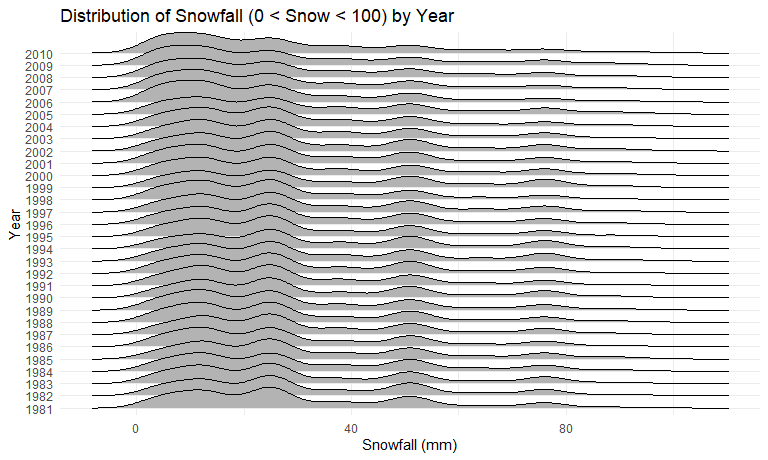
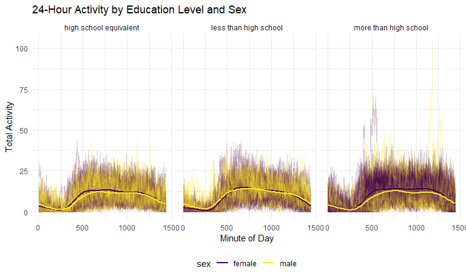

p8105_hw3_rcn2115
================
Riya Nadkarni

``` r
library(tidyverse)
```

    ## ── Attaching core tidyverse packages ──────────────────────── tidyverse 2.0.0 ──
    ## ✔ dplyr     1.1.4     ✔ readr     2.1.5
    ## ✔ forcats   1.0.0     ✔ stringr   1.5.1
    ## ✔ ggplot2   3.5.1     ✔ tibble    3.2.1
    ## ✔ lubridate 1.9.3     ✔ tidyr     1.3.1
    ## ✔ purrr     1.0.2     
    ## ── Conflicts ────────────────────────────────────────── tidyverse_conflicts() ──
    ## ✖ dplyr::filter() masks stats::filter()
    ## ✖ dplyr::lag()    masks stats::lag()
    ## ℹ Use the conflicted package (<http://conflicted.r-lib.org/>) to force all conflicts to become errors

``` r
library(ggridges)
library(p8105.datasets)
library(patchwork)
```

# Problem 1

## Visualizing Data

``` r
data("ny_noaa") 
print(ny_noaa)
```

    ## # A tibble: 2,595,176 × 7
    ##    id          date        prcp  snow  snwd tmax  tmin 
    ##    <chr>       <date>     <int> <int> <int> <chr> <chr>
    ##  1 US1NYAB0001 2007-11-01    NA    NA    NA <NA>  <NA> 
    ##  2 US1NYAB0001 2007-11-02    NA    NA    NA <NA>  <NA> 
    ##  3 US1NYAB0001 2007-11-03    NA    NA    NA <NA>  <NA> 
    ##  4 US1NYAB0001 2007-11-04    NA    NA    NA <NA>  <NA> 
    ##  5 US1NYAB0001 2007-11-05    NA    NA    NA <NA>  <NA> 
    ##  6 US1NYAB0001 2007-11-06    NA    NA    NA <NA>  <NA> 
    ##  7 US1NYAB0001 2007-11-07    NA    NA    NA <NA>  <NA> 
    ##  8 US1NYAB0001 2007-11-08    NA    NA    NA <NA>  <NA> 
    ##  9 US1NYAB0001 2007-11-09    NA    NA    NA <NA>  <NA> 
    ## 10 US1NYAB0001 2007-11-10    NA    NA    NA <NA>  <NA> 
    ## # ℹ 2,595,166 more rows

The `ny_noaa` dataset is pulled from the `p8105.datasets` package. It
contains weather observations from multiple weather stations across New
York State. It contains 2595176 rows and 7 columns.This dataset includes
the following key variables:

`id`: Weather station ID `date`: Date of observation `prcp`:
Precipitation (tenths of mm) `snow`: Snowfall (mm) `snwd`: Snow depth
(mm) `tmax`: Maximum temperature (tenths of degrees C) `tmin`: Minimum
temperature (tenths of degrees C)

We observe a lot of missing (NA) values in the dataset. Each weather
station may collect only a subset of these variables, and therefore the
resulting dataset contains extensive missing data.

## Cleaning data

``` r
noaa_clean_df <-ny_noaa %>% 
janitor::clean_names() %>% 
  mutate(
    year = year(date),
    month = month(date, label = TRUE),
    day = day(date),
    tmax = as.numeric(tmax) / 10,  
    tmin = as.numeric(tmin) / 10,  
    prcp = prcp / 10   
  ) %>% 
  select(-date)
  print(noaa_clean_df)
```

    ## # A tibble: 2,595,176 × 9
    ##    id           prcp  snow  snwd  tmax  tmin  year month   day
    ##    <chr>       <dbl> <int> <int> <dbl> <dbl> <dbl> <ord> <int>
    ##  1 US1NYAB0001    NA    NA    NA    NA    NA  2007 Nov       1
    ##  2 US1NYAB0001    NA    NA    NA    NA    NA  2007 Nov       2
    ##  3 US1NYAB0001    NA    NA    NA    NA    NA  2007 Nov       3
    ##  4 US1NYAB0001    NA    NA    NA    NA    NA  2007 Nov       4
    ##  5 US1NYAB0001    NA    NA    NA    NA    NA  2007 Nov       5
    ##  6 US1NYAB0001    NA    NA    NA    NA    NA  2007 Nov       6
    ##  7 US1NYAB0001    NA    NA    NA    NA    NA  2007 Nov       7
    ##  8 US1NYAB0001    NA    NA    NA    NA    NA  2007 Nov       8
    ##  9 US1NYAB0001    NA    NA    NA    NA    NA  2007 Nov       9
    ## 10 US1NYAB0001    NA    NA    NA    NA    NA  2007 Nov      10
    ## # ℹ 2,595,166 more rows

## Finding the most commonly observed value for snowfall

``` r
noaa_clean_df %>% 
  count(snow) %>% 
  arrange(desc(n))
```

    ## # A tibble: 282 × 2
    ##     snow       n
    ##    <int>   <int>
    ##  1     0 2008508
    ##  2    NA  381221
    ##  3    25   31022
    ##  4    13   23095
    ##  5    51   18274
    ##  6    76   10173
    ##  7     8    9962
    ##  8     5    9748
    ##  9    38    9197
    ## 10     3    8790
    ## # ℹ 272 more rows

The most commonly observed value for snowfall is 0 mm as snowfall does
not occur daily in most parts of New York throughout the year.

\##Making two-panel plots

``` r
avg_temp_df = noaa_clean_df %>% 
  filter(month %in% c("Jan", "Jul")) %>% 
  group_by(id, year, month) %>% 
  summarize(avg_tmax = mean(tmax, na.rm = TRUE))
```

    ## `summarise()` has grouped output by 'id', 'year'. You can override using the
    ## `.groups` argument.

``` r
ggplot(avg_temp_df, aes(x = year, y = avg_tmax, group = id)) + geom_point() + geom_path() +
  facet_grid(. ~ month) +
  labs(
    title = "Average Maximum Temperature in January and July by Station across years",
    x = "Year",
    y = "Average Maximum Temperature (°C)"
  ) 
```


The two-panel plot shows the average maximum temperature in January and
July by station from 1980-2010. The average maximum temperature for
January (winter) fluctuates between -10°C and 10°C with a few outliers
(lowest maximum temperature is -14°C). The average maximum temperatures
for June (summer) on the other hand lie between 20°C to 34 °C with a few
outliers (14°C). The fluctuation for temperatures in June is less than
the fluctuation in temperature in January.

``` r
tmax_tmin_df <- noaa_clean_df 
ggplot(tmax_tmin_df, aes(x = tmin, y = tmax)) + 
  geom_bin2d() +
  labs(
    title = "Maximum vs Minimum Temperatures",
    x = "Minimum Temperature (°C)",
    y = "Maximum Temperature (°C)"
  )
```


``` r
tmax_tmin_df
```

    ## # A tibble: 2,595,176 × 9
    ##    id           prcp  snow  snwd  tmax  tmin  year month   day
    ##    <chr>       <dbl> <int> <int> <dbl> <dbl> <dbl> <ord> <int>
    ##  1 US1NYAB0001    NA    NA    NA    NA    NA  2007 Nov       1
    ##  2 US1NYAB0001    NA    NA    NA    NA    NA  2007 Nov       2
    ##  3 US1NYAB0001    NA    NA    NA    NA    NA  2007 Nov       3
    ##  4 US1NYAB0001    NA    NA    NA    NA    NA  2007 Nov       4
    ##  5 US1NYAB0001    NA    NA    NA    NA    NA  2007 Nov       5
    ##  6 US1NYAB0001    NA    NA    NA    NA    NA  2007 Nov       6
    ##  7 US1NYAB0001    NA    NA    NA    NA    NA  2007 Nov       7
    ##  8 US1NYAB0001    NA    NA    NA    NA    NA  2007 Nov       8
    ##  9 US1NYAB0001    NA    NA    NA    NA    NA  2007 Nov       9
    ## 10 US1NYAB0001    NA    NA    NA    NA    NA  2007 Nov      10
    ## # ℹ 2,595,166 more rows

``` r
snowfall_df <- noaa_clean_df %>% 
  filter(snow > 0, snow < 100) %>%  
  ggplot(aes(x = snow, y = as.factor(year))) +
  geom_density_ridges() +
  labs(
    title = "Distribution of Snowfall (0 < Snow < 100) by Year",
    x = "Snowfall (mm)",
    y = "Year"
  )

snowfall_df
```

    ## Picking joint bandwidth of 3.76



The first two-panel plot shows a graph of tmax vs tmin for the entire
dataset. The majority of the data cluster tightly in the center of the
distribution.

The second two-panel plot shows the distribution of snowfall (0mm \<
Snow \< 100mm) separately by year.With the majority of snowfall events
concentrated around 0-35mm, the ridgeline plot displays a multimodal
density of snowfall within a given year as well as distributions across
years. The general trends point to a reasonably stable distribution of
snowfall totals with some variation from year to year.

\#Problem 2

\##Loading, Cleaning and Merging data

``` r
covar_df = read_csv("nhanes_covar.csv", na = c("NA", ".", ""), skip = 4) %>% 
janitor::clean_names() %>% 
  filter(age >= 21) %>% 
  mutate(
    sex = case_match(
      sex, 
      1 ~ "male",
      2 ~ "female"),
    education = case_match(
      education, 
      1 ~ "less than high school",
      2 ~ "high school equivalent",
      3 ~ "more than high school"),
    age = as.numeric(age),  
    BMI = as.numeric(bmi)
  )
```

    ## Rows: 250 Columns: 5
    ## ── Column specification ────────────────────────────────────────────────────────
    ## Delimiter: ","
    ## dbl (5): SEQN, sex, age, BMI, education
    ## 
    ## ℹ Use `spec()` to retrieve the full column specification for this data.
    ## ℹ Specify the column types or set `show_col_types = FALSE` to quiet this message.

``` r
print(covar_df)
```

    ## # A tibble: 231 × 6
    ##     seqn sex      age   bmi education                BMI
    ##    <dbl> <chr>  <dbl> <dbl> <chr>                  <dbl>
    ##  1 62161 male      22  23.3 high school equivalent  23.3
    ##  2 62164 female    44  23.2 more than high school   23.2
    ##  3 62169 male      21  20.1 high school equivalent  20.1
    ##  4 62174 male      80  33.9 more than high school   33.9
    ##  5 62177 male      51  20.1 high school equivalent  20.1
    ##  6 62178 male      80  28.5 high school equivalent  28.5
    ##  7 62180 male      35  27.9 more than high school   27.9
    ##  8 62184 male      26  22.1 high school equivalent  22.1
    ##  9 62189 female    30  22.4 more than high school   22.4
    ## 10 62191 male      70  NA   high school equivalent  NA  
    ## # ℹ 221 more rows

``` r
accel_df = read_csv("nhanes_accel.csv", na = c("NA", ".", "")) %>% 
   janitor::clean_names() %>% 
  pivot_longer(
    min1:min1440,
    names_to = "min",
    values_to = "mims",
    names_prefix = "min"
  ) %>% 
  mutate(
    min = as.numeric(min)
  )
```

    ## Rows: 250 Columns: 1441
    ## ── Column specification ────────────────────────────────────────────────────────
    ## Delimiter: ","
    ## dbl (1441): SEQN, min1, min2, min3, min4, min5, min6, min7, min8, min9, min1...
    ## 
    ## ℹ Use `spec()` to retrieve the full column specification for this data.
    ## ℹ Specify the column types or set `show_col_types = FALSE` to quiet this message.

``` r
print(accel_df)
```

    ## # A tibble: 360,000 × 3
    ##     seqn   min  mims
    ##    <dbl> <dbl> <dbl>
    ##  1 62161     1 1.11 
    ##  2 62161     2 3.12 
    ##  3 62161     3 1.47 
    ##  4 62161     4 0.938
    ##  5 62161     5 1.60 
    ##  6 62161     6 0.145
    ##  7 62161     7 2.10 
    ##  8 62161     8 0.509
    ##  9 62161     9 1.63 
    ## 10 62161    10 1.20 
    ## # ℹ 359,990 more rows

``` r
covar_accel_df = 
  left_join(
    covar_df, accel_df, by = c("seqn"))
```

Accelerometer data was collected on 250 participants in the NHANES
study. I loaded, tidied, merged, and organized `accel_df` and `covar_df`
datasets to create a `covar_accel_df` dataset. `nhanes_covar` contained
participants’ demographic data and `nhanes_accel` contained their
accelerometer data. The final dataset includes all originally observed
variables, excludes participants less than 21 years of age and those
with missing demographic data, and encodes data with reasonable variable
classes (i.e., not numeric, and using factors with the ordering of
tables and plots in mind). The combined dataset has 332640 rows and 8
columns.

## Creating a table

``` r
covar_accel_df %>% 
  group_by(sex, education) %>% 
  distinct(seqn) %>% 
  summarize(count = n()) %>% 
  knitr::kable()
```

    ## `summarise()` has grouped output by 'sex'. You can override using the `.groups`
    ## argument.

| sex    | education              | count |
|:-------|:-----------------------|------:|
| female | high school equivalent |    23 |
| female | less than high school  |    29 |
| female | more than high school  |    59 |
| male   | high school equivalent |    36 |
| male   | less than high school  |    28 |
| male   | more than high school  |    56 |

The table above shows the number of males and females in each education
category.

## Creating a boxplot

``` r
covar_accel_df %>% 
   ggplot(aes(x = education, y = age, fill = sex)) +
  geom_boxplot() + 
  labs(title = "Age Distribution by Sex and Education",
       y = "Age", 
       x = "Education") 
```


``` r
str(covar_accel_df)
```

    ## tibble [332,640 × 8] (S3: tbl_df/tbl/data.frame)
    ##  $ seqn     : num [1:332640] 62161 62161 62161 62161 62161 ...
    ##  $ sex      : chr [1:332640] "male" "male" "male" "male" ...
    ##  $ age      : num [1:332640] 22 22 22 22 22 22 22 22 22 22 ...
    ##  $ bmi      : num [1:332640] 23.3 23.3 23.3 23.3 23.3 23.3 23.3 23.3 23.3 23.3 ...
    ##  $ education: chr [1:332640] "high school equivalent" "high school equivalent" "high school equivalent" "high school equivalent" ...
    ##  $ BMI      : num [1:332640] 23.3 23.3 23.3 23.3 23.3 23.3 23.3 23.3 23.3 23.3 ...
    ##  $ min      : num [1:332640] 1 2 3 4 5 6 7 8 9 10 ...
    ##  $ mims     : num [1:332640] 1.106 3.115 1.468 0.938 1.599 ...

The boxplot shows the age distribution for males and females in
different education categories. In the `less than high school` and
`high school equivalent` categories, females have a slightly higher
median age compared to males. In the `more than high school` category,
the median ages of males are slightly higher than the median ages for
females.

## Creating the total activity variable and plotting it

``` r
totalactivity_df = covar_accel_df %>% 
  group_by(seqn, age, sex, education) %>% 
  summarize(totalactivity = sum(mims, na.rm = TRUE))
```

    ## `summarise()` has grouped output by 'seqn', 'age', 'sex'. You can override
    ## using the `.groups` argument.

``` r
totalactivity_df %>% 
  ggplot(aes(x = age, y = totalactivity, color = sex)) +
  geom_point(alpha=0.5) +
  geom_smooth(method = "loess", se = FALSE) + 
  facet_wrap(~ education) +
  labs(
    title = "Total Activity vs. Age",
    x = "Age",
    y = "Total Activity"
  ) 
```

    ## `geom_smooth()` using formula = 'y ~ x'


I created a `totalactivity_df` variable for each participant, and
plotted these total activities (y-axis) against age (x-axis). The plot
compares men to women and has a separate education panel for each
education level. Overall activity tends to decline with age across all
educational levels. Males and females typically exhibit comparable
trends in changes in overall activity as they age within each
educational level. With a few minor exceptions, women are generally more
active than men overall.

## Creating a three-panel plot

``` r
ggplot(covar_accel_df, aes(x = min, y = mims, group = seqn, color = sex)) +
  geom_line(alpha = .2) +
  geom_smooth(aes(group = sex), se = FALSE) +
  facet_grid(. ~ education) +
  labs(
    title = "24-Hour Activity by Education Level and Sex",
    x = "Minute of Day",
    y = "Total Activity",
  )
```

    ## `geom_smooth()` using method = 'gam' and formula = 'y ~ s(x, bs = "cs")'



I made a three-panel plot showing the 24-hour activity time courses for
each education level for males and females (males yellow, females
violet). For both `less than high school` and `high school equivalent`
education levels, males and females show similar activity patterns
throughout the day. For `more than high school`,females are more active
than males. Those with `more than high school` education show the most
heightened physical engagement peaks especially in the late morning and
early afternoon with males reaching 100 MIMS closer to afternoon.

\#Problem 3

``` r
citi_jan2020_df = 
   read_csv("Jan 2020 Citi.csv", na = c("NA",".","")) %>% 
  janitor::clean_names() %>% 
  mutate(year = 2020,
         month = "January") %>% 
   relocate(year, month, .before = ride_id)
```

    ## Rows: 12420 Columns: 7
    ## ── Column specification ────────────────────────────────────────────────────────
    ## Delimiter: ","
    ## chr (6): ride_id, rideable_type, weekdays, start_station_name, end_station_n...
    ## dbl (1): duration
    ## 
    ## ℹ Use `spec()` to retrieve the full column specification for this data.
    ## ℹ Specify the column types or set `show_col_types = FALSE` to quiet this message.

``` r
citi_jan2024_df = 
   read_csv("Jan 2024 Citi.csv", na = c("NA",".","")) %>% 
  janitor::clean_names() %>% 
  mutate(year = 2024,
         month = "January") %>% 
   relocate(year, month, .before = ride_id)
```

    ## Rows: 18861 Columns: 7
    ## ── Column specification ────────────────────────────────────────────────────────
    ## Delimiter: ","
    ## chr (6): ride_id, rideable_type, weekdays, start_station_name, end_station_n...
    ## dbl (1): duration
    ## 
    ## ℹ Use `spec()` to retrieve the full column specification for this data.
    ## ℹ Specify the column types or set `show_col_types = FALSE` to quiet this message.

``` r
citi_july2020_df = 
   read_csv("July 2020 Citi.csv", na = c("NA",".","")) %>% 
  janitor::clean_names() %>% 
  mutate(year = 2020,
         month = "July") %>% 
   relocate(year, month, .before = ride_id)
```

    ## Rows: 21048 Columns: 7
    ## ── Column specification ────────────────────────────────────────────────────────
    ## Delimiter: ","
    ## chr (6): ride_id, rideable_type, weekdays, start_station_name, end_station_n...
    ## dbl (1): duration
    ## 
    ## ℹ Use `spec()` to retrieve the full column specification for this data.
    ## ℹ Specify the column types or set `show_col_types = FALSE` to quiet this message.

``` r
citi_july2024_df = 
   read_csv("July 2024 Citi.csv", na = c("NA",".","")) %>% 
  janitor::clean_names() %>% 
  mutate(year = 2024,
         month = "July") %>% 
   relocate(year, month, .before = ride_id)
```

    ## Rows: 47156 Columns: 7
    ## ── Column specification ────────────────────────────────────────────────────────
    ## Delimiter: ","
    ## chr (6): ride_id, rideable_type, weekdays, start_station_name, end_station_n...
    ## dbl (1): duration
    ## 
    ## ℹ Use `spec()` to retrieve the full column specification for this data.
    ## ℹ Specify the column types or set `show_col_types = FALSE` to quiet this message.

``` r
citibike_df = bind_rows(citi_jan2020_df, citi_july2020_df, citi_jan2024_df, citi_july2024_df) %>% 
  mutate(
    weekdays = factor(weekdays, levels = c("Monday","Tuesday","Wednesday","Thursday","Friday","Saturday","Sunday"), ordered = TRUE))
```

I merged four datasets that each contained 1% of all NYC Citi Bike
system rides with a total duration less than 4 hours in each of the four
months (Jan 2020, Jan 2024, July 2020, July 2024). I created `year` and
`month` variables to each dataset to understand which dataset each
observation came from. The combined dataset has 99485 rows and 9
columns, and includes the variables `year`, `month`, `ride_id`,
`rideable_type`, `weekday`, `duration`, `start_station_name`,
`end_station_name`, and `member_casual`. There are a total of 99485
rides recorded with a mean ride duration of 13.9301375. There are 2241
distinct starting stations.

## Creating tables

``` r
table_df = citibike_df %>% 
  group_by(year, month, member_casual) %>% 
  summarize(count = n()) %>% 
  knitr::kable()
```

    ## `summarise()` has grouped output by 'year', 'month'. You can override using the
    ## `.groups` argument.

``` r
table_df
```

| year | month   | member_casual | count |
|-----:|:--------|:--------------|------:|
| 2020 | January | casual        |   984 |
| 2020 | January | member        | 11436 |
| 2020 | July    | casual        |  5637 |
| 2020 | July    | member        | 15411 |
| 2024 | January | casual        |  2108 |
| 2024 | January | member        | 16753 |
| 2024 | July    | casual        | 10894 |
| 2024 | July    | member        | 36262 |

The above table shows the total number of rides in each combination of
year and month separating casual riders and Citi Bike members. Each
combination of month and year shows that members more frequently ride
the bike than casual individuals. There were a lot more riders in 2024
than 2020, with the highest amount of rides in July 2024 and the lowest
amount of rides in January 2020.

``` r
pop_july2024_df = citibike_df %>% 
  filter(month == "July" & year == "2024") %>% 
  group_by(start_station_name) %>% 
  summarize(count = n()) %>% 
  arrange(desc(count)) %>% 
  head(5) %>% 
  knitr::kable()

pop_july2024_df
```

| start_station_name       | count |
|:-------------------------|------:|
| Pier 61 at Chelsea Piers |   163 |
| University Pl & E 14 St  |   155 |
| W 21 St & 6 Ave          |   152 |
| West St & Chambers St    |   150 |
| W 31 St & 7 Ave          |   146 |

The table above shows the five most popular starting stations for July
2024 and includes the number of rides originating from these stations.

## Plotting graph

``` r
ride_duration_df = citibike_df %>% 
  group_by(year, month, weekdays) %>% 
  mutate(med_duration = median(duration)) %>% 
  ggplot(aes(x = weekdays, y = med_duration, fill = as.factor(year))) + 
  geom_bar(stat = "identity", position = "dodge") +
  facet_grid(~month) + 
  theme(axis.text = element_text(angle = 45, vjust = 1, hjust = 1))

ride_duration_df
```


I plotted a bar graph to investigate the effects of day of the week,
month, and year on median ride duration. The median duration of bike
rides was similar for June and July of 2024. However, in 2020, the
median duration of bike rides in July was higher than the median
duration of bike rides in June. People rode bikes for a slightly longer
duration on the weekends in July of both 2020 and 2024.

``` r
citibikes2024_df = citibike_df %>% 
  filter(year == 2024) %>% 
  ggplot(aes(x = member_casual, y = duration, fill = rideable_type)) +
  geom_boxplot(outlier.shape = NA) +
  facet_grid(~ month) +
    scale_y_continuous(limits = c(0, 50)) + 
  labs(
    title = "Distribution of Ride Duration by Month, Membership Status, and Bike Type (2024)",
    x = "Membership Status",
    y = "Ride Duration (minutes)",
    fill = "Bike Type"
  ) 

citibikes2024_df
```


The above boxplot shows the distributon of ride duration by month,
membership status, and bike type. We observe a large number of outliers
across the two groups. Casual bike riders with a classic bike had a
slightly higher ride duration than casual riders with an electric bike
for January and July 2024. For July, members with an eletric bike had a
higher ride duration than those a classic bike.
